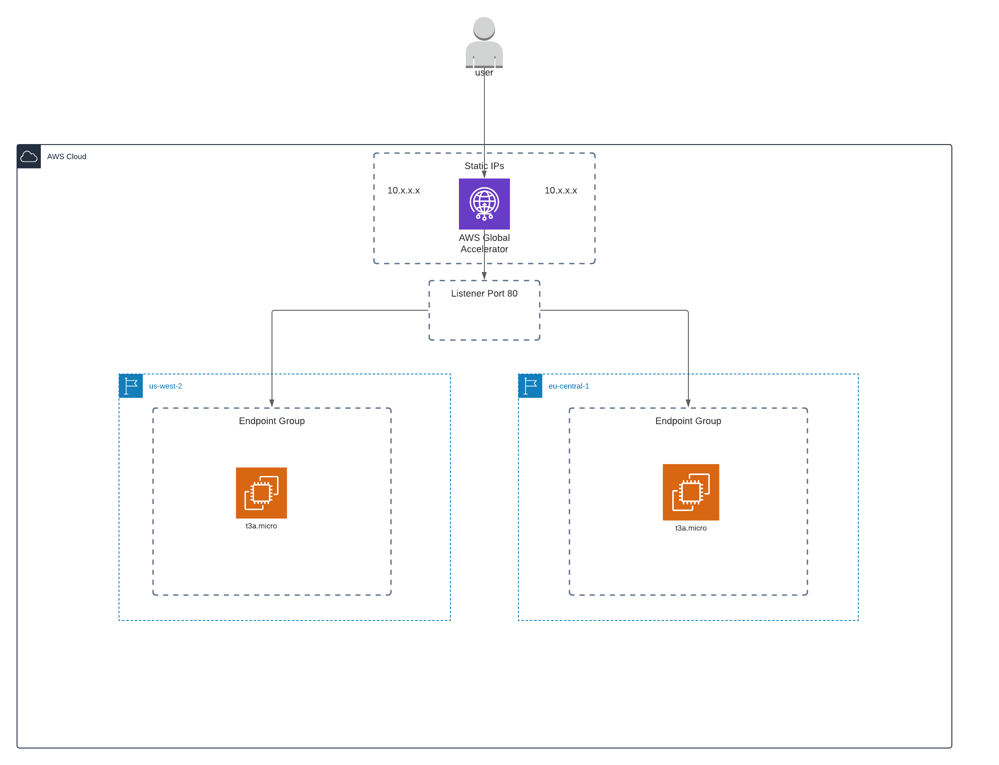

# Multi-Region Global Accelerator

This project consists of Pulumi IaC that is meant to automate the creation of a multi-regional website that uses [AWS Global Accelerator](https://docs.aws.amazon.com/global-accelerator/latest/dg/what-is-global-accelerator.html).

## Requirements
1. [Nodejs](https://nodejs.org/en/)
2. [Pulumi](https://www.pulumi.com/)

## Prerequisite
You must configure the stacks to use for the web servers in each region. In this example, I am using my own personal sandbox AWS account and stacks. You should replace them with your own via the following commands:

1. `cd accelerator`
2. `pulumi config set westStack aiell0/global-accelerator-demo/webserver-west`
3. `pulumi config set europeStack aiell0/global-accelerator-demo/webserver-eu`.

## Deploy
1. `cd frontend`
2. `pulumi stack select webserver-eu`
3. `pulumi up`
4. `pulumi stack select webserver-west`
5. `pulumi up`
6. `cd ..`
7. `cd accelerator`
8. `pulumi up`

## Destroy
1. `cd accelerator`
2. `pulumi destroy`
3. `cd ..`
4. `cd frontend`
5. `pulumi stack select webserver-eu`
6. `pulumi destroy`
7. `pulumi stack select webserver-west`
8. `pulumi destroy`

**There is a bug with Pulumi where you can't delete the VPCs if they were created using [Pulumi Crosswalk](pulumi.com/docs/guides/crosswalk/aws/vpc/). A [Github Issue](https://github.com/pulumi/pulumi/issues/6147) has been created to track it. For now, just go in and delete the VPC manually if it does time out, and resume the destroy.**